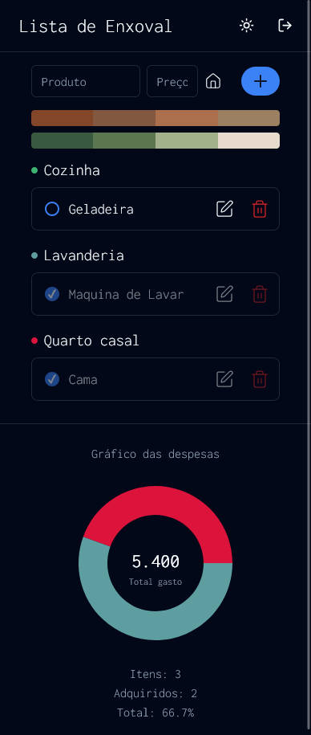

# Lista de Casamento

Um aplicativo web moderno e full-stack para gerenciar sua lista de presentes de casamento (Lista de Enxoval). Organize, categorize e acompanhe o status de compra dos itens, visualize despesas e colabore com facilidade. Construído com Next.js 14, Prisma, MongoDB, Tailwind CSS e Radix UI.

## ✨ Funcionalidades

- **Autenticação de Usuário**: Login e cadastro seguros com senhas criptografadas.
- **Gerenciamento de Itens**: Adicione, atualize, exclua e marque itens como comprados.
- **Categorias**: Organize itens por categorias personalizáveis com cores.
- **Links**: Anexe e gerencie links para cada item (ex: URLs de lojas).
- **Controle de Gastos**: Visualize despesas totais e porcentagem de compras com gráficos interativos.
- **Interface Responsiva**: Interface moderna e limpa com alternância entre tema claro e escuro.
- **Feedback**: Notificações tipo toast para ações e erros.

## 🛠️ Stack Tecnológico

- **Frontend**: [Next.js](https://nextjs.org/) 14, [React](https://react.dev/), [Tailwind CSS](https://tailwindcss.com/), [Radix UI](https://www.radix-ui.com/), [Lucide Icons](https://lucide.dev/)
- **Backend**: [Next.js Server Actions](https://nextjs.org/docs/app/building-your-application/data-fetching/server-actions), [Prisma ORM](https://www.prisma.io/)
- **Banco de Dados**: [MongoDB](https://www.mongodb.com/)
- **Autenticação**: [NextAuth.js](https://next-auth.js.org/) com Prisma Adapter
- **Gráficos**: [Recharts](https://recharts.org/)
- **Notificações**: [Sonner](https://sonner.emilkowal.ski/)

## 🚀 Primeiros Passos

### Pré-requisitos

- Node.js 18+
- Banco de dados MongoDB (local ou na nuvem)
- [pnpm](https://pnpm.io/), [yarn](https://yarnpkg.com/), ou [npm](https://www.npmjs.com/)

### Instalação

1. **Clone o repositório:**
   ```sh
   git clone https://github.com/seunomeusuario/wedding-list-nextjs.git
   cd wedding-list-nextjs
   ```
2. **Configure as variáveis de ambiente:**
   ```sh
    npm install
   ```
3. **Instale as dependências:**

   Crie o arquivo .env na raiz do projeto, precisa conter o DATABASE_URL e NEXT_AUTH_SECRET:

4. **Gere o cliente Prisma:**
   ```sh
    npx prisma generate
   ```
5. **Execute o servidor de desenvolvimento:**
   ```sh
    npm run dev
   ```
6. **Veja em qual porta foi iniciada:**

   Ao executar o passo 5 ira aparecer a posrta que está sendo executada.

## 📊 Pagina Inicial



## 🤝 Contribuindo

Contribuições são bem-vindas! Abra uma issue ou envie um pull request.
